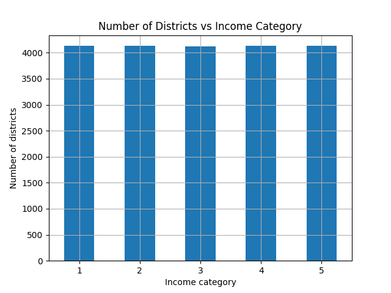
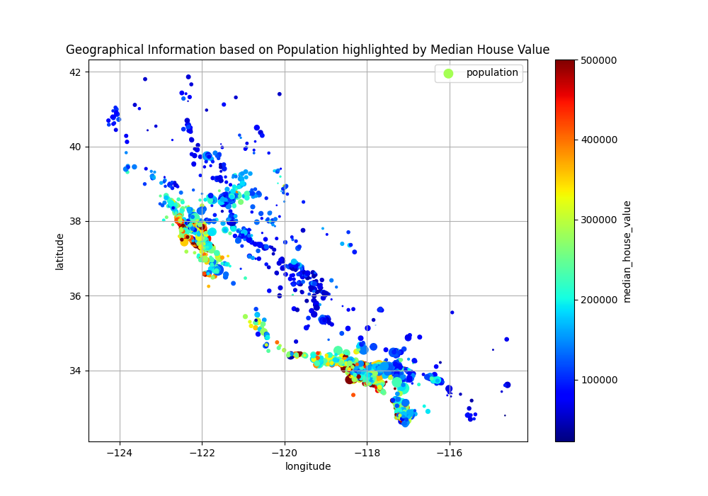
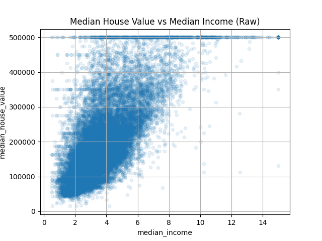
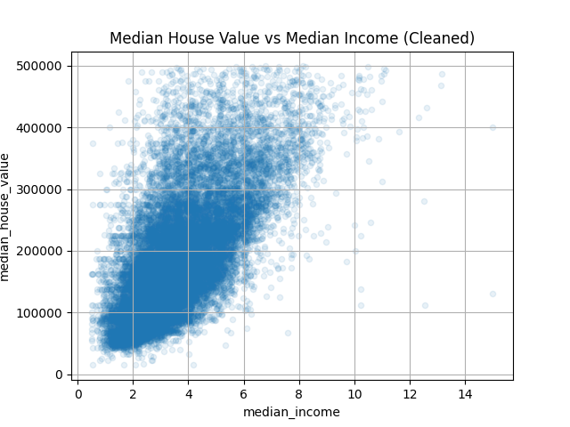

## Report

### Question 1
Show that the random samples are always the same with the same random state.

#### Code
```python
trainSplit, testSplit = train_test_split(housing, test_size=0.2, random_state=42)  

second_trainSplit, second_testSplit = train_test_split(housing, test_size=0.2, random_state=42)  
```

#### Output
```
Random Data and Random State
--------------------
First Random Training Sample (Rows 1-5)
       longitude  latitude  ...  median_house_value  ocean_proximity
8267     -117.03     32.69  ...            156100.0       NEAR OCEAN
17445    -122.27     37.74  ...            353900.0         NEAR BAY
14265    -121.82     37.25  ...            241200.0        <1H OCEAN
2271     -115.98     33.32  ...             53800.0           INLAND

First Random Test Sample (Rows 1-5)
       longitude  latitude  ...  median_house_value  ocean_proximity
3024     -118.37     33.83  ...            353400.0        <1H OCEAN
15663    -117.24     32.72  ...            466700.0       NEAR OCEAN
20484    -118.44     34.05  ...            500001.0        <1H OCEAN
9814     -118.44     34.18  ...            286100.0        <1H OCEAN

Second Random Training Sample (Rows 1-5)
       longitude  latitude  ...  median_house_value  ocean_proximity
8267     -117.03     32.69  ...            156100.0       NEAR OCEAN
17445    -122.27     37.74  ...            353900.0         NEAR BAY
14265    -121.82     37.25  ...            241200.0        <1H OCEAN
2271     -115.98     33.32  ...             53800.0           INLAND

Second Random Test Sample (Rows 1-5)
       longitude  latitude  ...  median_house_value  ocean_proximity
3024     -118.37     33.83  ...            353400.0        <1H OCEAN
15663    -117.24     32.72  ...            466700.0       NEAR OCEAN
20484    -118.44     34.05  ...            500001.0        <1H OCEAN
9814     -118.44     34.18  ...            286100.0        <1H OCEAN
```

### Question 2
Split the data uniformly into 5 categories based on median income using pd cuts. Plot the result.
#### Code
```python
housing["income_cat"] = pd.qcut(housing["median_income"], q=5, labels=[1, 2, 3, 4, 5])
```
#### Plot


### Question 3
Plot the test dataset to visualize the geographical information

#### Code
```python
strat_test_set.plot(kind="scatter", x="longitude", y="latitude", grid=True,  
                    s=strat_test_set["population"] / 100, label="population",  
                    c="median_house_value", cmap="jet", colorbar=True,  
                    legend=True, sharex=False, figsize=(10, 7))
```

#### Plot


### Question 4
Remove entries from the dataset that do not align with the pattern and plot.

#### Code
```python
# Raw Dataset
housing.plot(kind="scatter", x="median_income", y="median_house_value", alpha=0.1, grid=True)

# Cleaned dataset
bad_data = housing[(housing['median_house_value'].isin([450000, 350000, 280000])) | (housing['median_house_value'] >= 499500)].index
cleaned_housing = housing.drop(bad_data)
cleaned_housing.plot(kind="scatter", x="median_income", y="median_house_value", alpha=0.1, grid=True)
```

#### Plots
####
**RAW**



**CLEANED**




### Question 5
Use the Linear Regression model fit to the training set to predict the training values and calculate RMSE

#### Code
```python
lin_reg.fit(train_imputed, train_labels)
train_predictions = lin_reg.predict(train_imputed)

rmse = root_mean_squared_error(train_labels, train_predictions)
```

#### Output
```
Training Predictions and RMSE
--------------------
[297700. 217700. 282700. 148600. 331700.]
[288900. 201100. 254200.  91600. 340900.]
RMSE: 70278.61993453879
```

### Question 6
Use the Linear Regression model fit to the training set to predict the test values and calculate RMSE

#### Code
```python
predictions = lin_reg.predict(test_imputed)

rmse = root_mean_squared_error(test_labels, predictions)
```

#### Output
```
Test Predictions and RMSE (same model)
--------------------
Predictions: [305500. 224000. 330300. 236900. 205100.]
Actual: [285400. 151300. 344000. 158200. 228100.]
RMSE: 67147.98294240306
```
